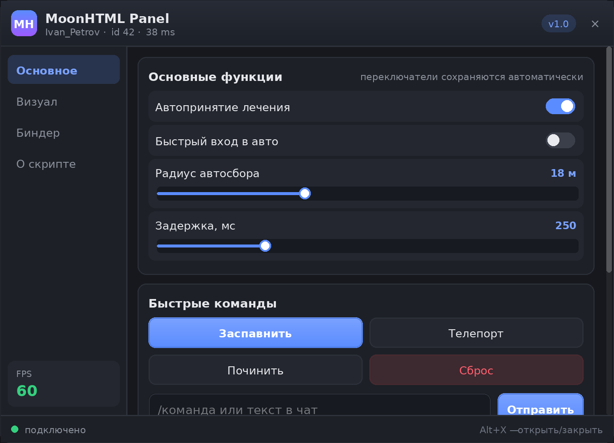
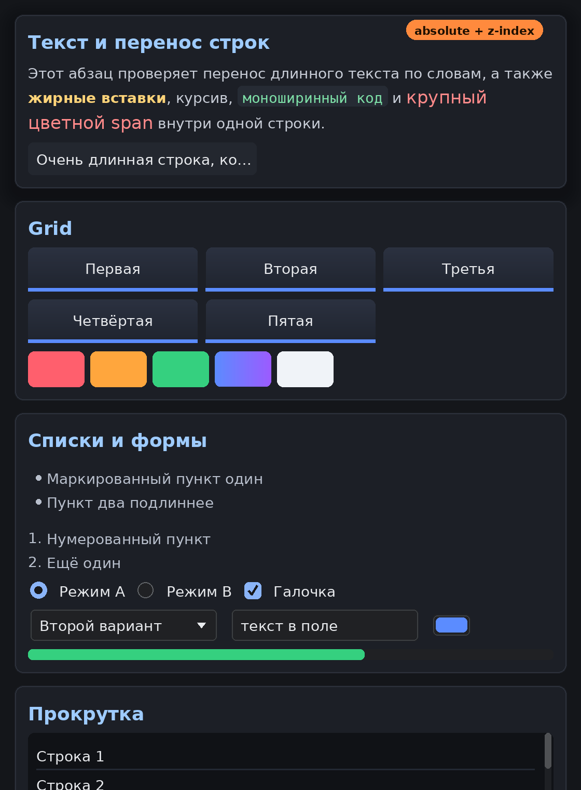

# moonhtml

**Меню для MoonLoader на HTML и CSS вместо mimgui.**

```lua
local moonhtml = require 'moonhtml'

local menu = moonhtml.new{
  key = vkeys.VK_X,
  html = [[
    <style>
      .btn { padding: 8px 14px; border-radius: 8px; background: #5b8cff; color: #fff }
      .btn:hover { background: #7aa2ff }
    </style>
    <button class="btn" id="go">Поехали</button>
  ]],
}

menu:on('#go', 'click', function() sampAddChatMessage('go!', -1) end)
```

Никаких `imgui.Begin` / `imgui.SameLine` / `imgui.PushStyleVar` — разметка и стили
отдельно, логика отдельно, как в вебе.



*(скриншот сгенерирован самим движком: `tests/snapshot.lua` + `tools/render_png.py`)*

---

## Что это на самом деле

Это **не CEF и не встроенный браузер**. Настоящий CEF — это ~150 МБ бинарников,
отдельный процесс и нативный плагин; для MoonLoader такого рабочего решения нет,
а если бы и было — оно бы стоило десятки FPS и не дружило бы с DirectX-хуками игры.

moonhtml — это **свой движок вёрстки на чистом Lua**: он сам парсит HTML и CSS,
считает каскад стилей, раскладывает боксы (block / inline / flex / grid /
absolute), рисует результат и разбирает события. Рисование идёт через
`ImDrawList` из mimgui — то есть mimgui остаётся, но вы его больше не пишете
руками, он работает как графический бэкенд.

Что это даёт на практике:

| | mimgui | moonhtml |
|---|---|---|
| Разметка | код на Lua | HTML |
| Оформление | `PushStyleVar` / `PushStyleColor` | CSS, включая `:hover` и переходы |
| Изменить дизайн | переписать функцию отрисовки | поправить `.css` |
| Зависимости | mimgui | mimgui (и всё) |
| Размер | — | ~6 000 строк Lua, без бинарников |

Ограничения честно перечислены в разделе [Чего нет](#чего-нет).

---

## Установка

```
moonloader/
  lib/
    moonhtml/          <- содержимое lib/moonhtml из этого репозитория
      init.lua
      ...
  menu.lua             <- ваш скрипт
```

Нужен установленный **mimgui** (`moonloader/lib/mimgui`). Больше ничего.

Файлы `.html` и `.css` сохраняйте в **UTF-8** — движок работает с UTF-8 строками,
кириллица поддерживается.

---

## Быстрый старт

Разметку можно писать прямо в скрипте или держать в отдельных файлах:

```lua
local menu = moonhtml.new{
  file = getWorkingDirectory() .. '/menu/index.html',  -- <link> и <script src> резолвятся рядом
  title = 'Моё меню',      -- уникальный id окна ImGui
  size = { 720, 520 },     -- размер окна в пикселях
  pos = 'center',          -- или { x, y }
  key = vkeys.VK_X,        -- клавиша переключения
  visible = false,
  lockPlayer = true,       -- заморозить управление, пока меню открыто
  env = { chat = sampAddChatMessage },  -- что видно из onclick="..." и <script>
}

menu:show()      -- показать
menu:hide()      -- скрыть
menu:toggle()    -- переключить
menu.visible     -- текущее состояние
```

Окно рисуется без рамки ImGui: заголовок, кнопка закрытия и фон — это ваш HTML.

* атрибут `data-drag` на элементе — за него окно перетаскивается;
* атрибут `data-close` — клик закрывает окно.

```html
<header data-drag>
  <span>Моё меню</span>
  <div class="close" data-close>&times;</div>
</header>
```

---

## События

Селекторы такие же, как в CSS. Обработчик получает `event` и сам узел:

```lua
menu:on('#save',      'click',  function(event, node) ... end)
menu:on('.tab',       'click',  function(event, node) node:addClass('active') end)
menu:on('#volume',    'input',  function(event, node) print(node:getValue()) end)
menu:on('#godmode',   'change', function(event, node) print(node:isChecked()) end)
menu:on('.card',      'mouseenter', function(event, node) ... end)
```

Обработчики делегируются от корня документа, поэтому работают и для элементов,
созданных позже.

События: `click`, `mousedown`, `mouseup`, `mouseenter`, `mouseleave`,
`contextmenu`, `wheel`, `scroll`, `input`, `change`, `focus`, `blur`, `submit`.

Всплытие останавливается через `event:stopPropagation()`.

Можно и прямо в разметке — код выполняется как Lua в окружении `env`:

```html
<button onclick="chat('привет из HTML')">Написать в чат</button>
<button onclick="this:addClass('active')">Подсветить себя</button>
```

Внутри доступны `this` (узел), `event`, `document`, `state` и всё из `env`.

---

## Данные: `{{ }}` и state

`state` — обычная таблица; при записи в неё все `{{ }}` в разметке
пересчитываются на следующем кадре.

```html
<div class="hp">HP: {{ state.hp }}%</div>
<div class="chip {{ state.mode }}">режим</div>
```

```lua
menu.doc.state.hp = 87
menu.doc.state.mode = 'danger'   -- попадёт в class="chip danger"
```

Если меняете таблицу внутри state (`table.insert(state.list, ...)`), вызовите
`menu.doc:refresh()` — присваивания там не видно.

---

## DOM

```lua
local node = menu:getElementById('hp')
local list = menu:querySelectorAll('.row input[type="checkbox"]')

node:setText('80%')                     -- текст
node:setHTML('<b>80%</b>')              -- разметка
node:append('<div class="row">…</div>') -- дописать в конец
node:remove()

node:addClass('active'):removeClass('off')
node:toggleClass('active', true)
node:hasClass('active')

node.style.width = '80%'                -- инлайновый стиль
node.style.backgroundColor = '#ff0000'  -- как в JS, camelCase тоже работает
node:hide() / node:show() / node:toggle()

node:getValue() / node:setValue('текст')
node:isChecked() / node:setChecked(true)
node:setDisabled(true)

node:getAttribute('data-id')
node:setAttribute('data-id', '42')

local x, y, w, h = node:rect()           -- позиция после раскладки
```

`<script>` внутри разметки выполняется как **Lua** при загрузке документа:

```html
<script>
  document:getElementById('title'):setText('Загружено')
</script>
```

---

## Поддерживаемый CSS



**Селекторы**
`tag`, `.class`, `#id`, `*`, `a b`, `a > b`, `a + b`, `a ~ b`, `[attr]`,
`[attr="v"]`, `[attr^=]`, `[attr$=]`, `[attr*=]`, `[attr~=]`,
`:hover`, `:active`, `:focus`, `:checked`, `:disabled`, `:enabled`,
`:first-child`, `:last-child`, `:only-child`, `:nth-child(n | odd | even | an+b)`,
`:nth-last-child()`, `:empty`, `:root`, `:not()`, `:is()`.
Каскад по специфичности, `!important`, инлайновый `style=""`.

**Раскладка**
`display: block | inline | inline-block | flex | inline-flex | grid | list-item | none`,
`position: static | relative | absolute | fixed` + `top/right/bottom/left`,
`width/height`, `min-*`, `max-*`, `margin` (в т.ч. `auto`), `padding`,
`box-sizing` (по умолчанию **border-box**), `overflow-x/y: visible | hidden | auto | scroll`,
`z-index`, `float` игнорируется.

**Flexbox**
`flex-direction` (в т.ч. `-reverse`), `flex-wrap`, `justify-content`
(`flex-start | center | flex-end | space-between | space-around | space-evenly`),
`align-items`, `align-self`, `align-content`, `flex-grow`, `flex-shrink`,
`flex-basis`, `flex`, `order`, `gap` / `row-gap` / `column-gap`.
Реализован полноценный цикл разрешения размеров с заморозкой элементов и
автоминимумом (`min-width: auto`), поэтому шапка и футер не выдавливаются
за край окна.

**Grid**
`display: grid` + `grid-template-columns` (`px`, `%`, `fr`, `repeat(n, …)`), `gap`,
`colspan` через атрибут.

**Текст**
`color`, `font-size`, `font-family` (`default` / `mono`), `font-weight`,
`font-style`, `line-height`, `letter-spacing`, `text-align`,
`text-decoration: underline | line-through`, `text-transform`,
`white-space: normal | nowrap | pre | pre-wrap`, `text-overflow: ellipsis`,
перенос по словам, разные шрифты и размеры в одной строке.

**Оформление**
`background-color`, `background-image: linear-gradient(deg | to …, стоп, стоп)`,
`border` (по сторонам), `border-radius` (по углам), `box-shadow`, `opacity`,
`visibility`, `cursor`, `pointer-events`, `transform: translate/scale`.

**Цвета**
`#rgb`, `#rgba`, `#rrggbb`, `#rrggbbaa`, `rgb()`, `rgba()`, `hsl()`, `hsla()`,
~70 именованных цветов, `transparent`, `currentColor`.

**Единицы**
`px`, `%`, `em`, `rem`, `vw`, `vh`, `vmin`, `vmax`, `pt`, `fr`,
`calc()` (сложение/вычитание `%` и длин).

**Переменные**
```css
body { --accent: #5b8cff; }
.btn { background: var(--accent); border: 1px solid var(--accent, #888); }
```

**Переходы**
```css
.btn { transition: background-color 0.15s ease, transform 0.2s; }
.btn:hover { transform: translateY(-1px); }
```
Анимируются цвета, длины в `px`, `opacity`, `font-size`, `border-radius`,
`transform`. Пока идёт переход, кадры пересчитываются автоматически.

**Медиазапросы**
```css
@media (max-width: 480px) { nav { display: none } }
```
Считаются от размера окна меню, а не экрана.

**Элементы форм**
`<button>`, `<input type=text|password|number|checkbox|radio|range|color|button>`,
`<textarea>`, `<select>` + `<option>`, `<progress>`, `<label for="…">`.
Чекбокс, которому задали ширину заметно больше высоты, рисуется как
переключатель-тумблер. Текстовые поля отдаются нативному `ImGui::InputText`,
поэтому в них работают выделение, буфер обмена и IME.

---

## Чего нет

Честный список — чтобы не было сюрпризов:

- **JavaScript.** `<script>` — это Lua. Так и задумано: движок для MoonLoader.
- **Схлопывание вертикальных отступов** (margin collapsing). `margin: 8px 0`
  у соседних блоков даёт 16px, как в flex-раскладке, а не 8px как в браузере.
- **`float`**, таблицы с настоящей раскладкой (`<table>` ведёт себя как блок).
- **Скругление при обрезке.** `overflow: hidden` обрезает по прямоугольнику:
  `PushClipRect` в ImGui не умеет скруглённые углы.
- **`::before` / `::after`**, `content`, `@keyframes`, фильтры, `backdrop-filter`.
- **Многострочный инлайн-бордер** рисуется по фрагменту на строку.
- **Картинки** (``, `background-image: url()`) требуют загрузчика текстур:
  передайте `loadTexture = function(path) return ... end` в `moonhtml.new`.
  Без него на месте картинки будет заглушка.
- Градиент рисуется полосами (24 шт.) — это ограничение `ImDrawList`.

---

## Шрифты и кириллица

По умолчанию движок ищет системные TTF (`trebuc`, `arial`, `segoeui`,
`consola`) и грузит их с кириллическим диапазоном в нескольких размерах.
Если хочется свой шрифт:

```lua
local menu = moonhtml.new{
  fonts = {
    { family = 'default', weight = 'normal', file = 'C:/Windows/Fonts/segoeui.ttf',
      sizes = { 12, 14, 16, 20, 28 } },
    { family = 'default', weight = 'bold',   file = 'C:/Windows/Fonts/segoeuib.ttf',
      sizes = { 12, 14, 16, 20, 28 } },
    { family = 'mono',    weight = 'normal', file = 'C:/Windows/Fonts/consola.ttf',
      sizes = { 12, 14 } },
  },
  html = '…',
}
```

Размер из CSS подбирает ближайший загруженный кегль — поэтому перечисляйте те
размеры, которые реально используете в стилях.

---

## Производительность

Движок считает ровно столько, сколько нужно:

- **Кадр без изменений ничего не делает** — display list переиспользуется.
- **Наведение мыши** пересчитывает стили, но **не раскладку**: движок сравнивает
  только те свойства, которые влияют на геометрию, и если изменился лишь цвет —
  layout не запускается.
- Правила разложены по корзинам (id / класс / тег), проверяются не все подряд.
- Разобранные длины и цвета кешируются по строке, ширины текста — по
  (шрифт, размер, строка).
- Контейнер с прокруткой раскладывается за один проход: нужна ли полоса
  прокрутки, движок помнит с прошлого кадра.

Замеры на демо-меню из `examples/` (216 узлов, 138 команд отрисовки),
`lua5.1 tests/bench.lua`:

```
idle (nothing changes)               0.003 ms/frame
mouse moving over the menu           1.722 ms/frame
state updated every frame            4.128 ms/frame
full restyle every frame             4.642 ms/frame
restyle + relayout every frame       9.217 ms/frame
```

Это **worst case**: обычный интерпретатор Lua 5.1. MoonLoader работает на
LuaJIT, который на таком коде в несколько раз быстрее. И, что важнее, в
реальном меню верхние строки — это то, что происходит каждый кадр, а нижние —
только когда вы сами меняете разметку.

---

## Тесты без игры

Движок не зависит от mimgui, пока вы не позвали `moonhtml.new`, — его можно
гонять в обычном Lua 5.1 / LuaJIT:

```bash
cd moonhtml
lua5.1 tests/run.lua          # 43 теста: парсер, каскад, раскладка, события
```

И даже посмотреть на результат картинкой:

```bash
lua5.1 tests/snapshot.lua examples/menu/index.html out.json 720 520
python3 tools/render_png.py out.json preview.png
```

`tests/snapshot.lua` прогоняет документ через настоящий пайплайн (стили →
раскладка → события → display list), а `tools/render_png.py` рисует тот же
display list, что уходит в `ImDrawList`. Оба скриншота в этом README сделаны
именно так.

Свои меню можно тестировать так же:

```lua
local doc = moonhtml.headless{ html = '…', width = 400, height = 300 }
doc:update(nil, 0)
local btn = doc:getElementById('go')
local x, y, w, h = btn:rect()
assert(w > 0)
```

---

## Структура

```
lib/moonhtml/
  init.lua            публичный API
  html.lua            парсер разметки
  css.lua             парсер стилей, селекторы, сокращения
  dom.lua             дерево узлов и DOM-подобный API
  ua.lua              стили по умолчанию
  style.lua           каскад, вычисленные значения, переменные, переходы
  layout.lua          block / inline / flex / grid / absolute / прокрутка
  paint.lua           display list
  widgets.lua         элементы форм
  events.lua          попадание курсора, hover/active/focus, диспетчеризация
  document.lua        всё вместе + шаблоны + скрипты
  window.lua          окно mimgui
  backends/
    mimgui.lua        display list -> ImDrawList
    headless.lua      метрики текста без игры
```

Зависимости между модулями идут строго вниз: `layout` не знает про mimgui,
`style` не знает про раскладку, `paint` не знает про ImGui. Поэтому бэкенд
меняется без правок движка.

## Лицензия

MIT.
